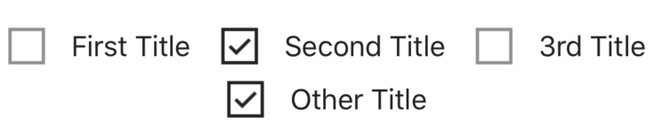
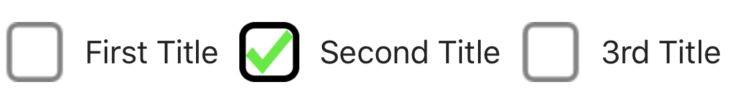
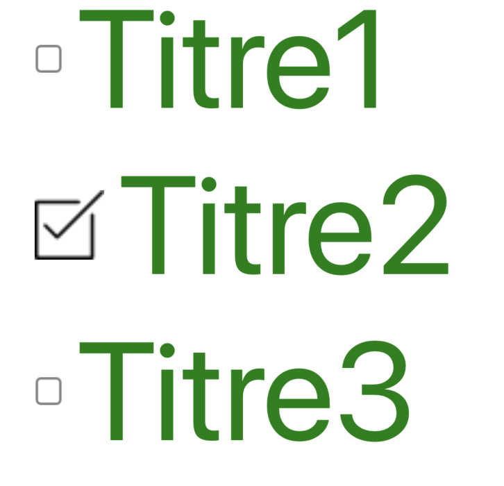
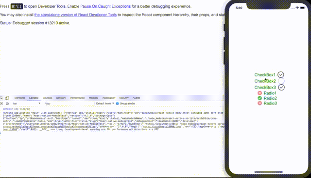

#### React-Native-Custom-Group-Selector

This is a React-Native library that allows you to easily build selection groups. 

1. The choice of the group can be multiple (checkbox type)
2. The choice of the group can be unique (type radiobutton)

###### module installation

```shell
npm install --save 'react-native-custom-select-group'
```

#### Basic usage
First, you must choose `'checkbox'` or `'radio'`

```javascript
import RNCustomSelectGroup from 'react-native-custom-select-group';
// Checkbox type
<RNCustomSelectGroup 
  selectType={'checkbox'}
  datas={datas}
  selected={[1, 3]}
  onSelectionChange={(arrayOfSelected) => console.log(arrayOfSelected)}
/>
```
```javascript
// Radio type
<RNCustomSelectGroup 
  selectType={'radio'}
  datas={datas}
  selected={1}
  onSelectionChange={(newSelectedIdx, newSelectedValue) => console.log(newSelectedIdx, newSelectedValue)}
/>
```
the minimum for component to work is an object array with a `label` key

```javascript
const datas = [
  {label: 'First Title'},
  {label: 'Second Title'},
  {label: '3rd Title'},
  {label: 'Other Title'}
]
```
If you don't specify a style, by default the container is flexrow and space-around


### Significant difference between 'checkbox' and 'radio'
The only difference between the two is that for every change :

- `'checkbox'` will return an array with the selection indexes
- `'radio'` will return two values, the first will be the selection index in the array and the second will be the value attribute (only if the objects contain a `value` key)

### Component customisation
You can pass your own images, you can also stylize the container as well as image and label in checked and unchecked

custom images (in datas array) :

```javascript
const datasCheckBoxes = [
  {label: 'First Title', picto: {checked: "http://url-to-my-images/checked", unchecked: "http://url-to-my-images/unchecked"}},
  {label: 'Second Title', picto: {checked: "http://url-to-my-images/checked", unchecked: "http://url-to-my-images/unchecked"}},
  {label: '3rd Title', picto: {checked: "http://url-to-my-images/checked", unchecked: "http://url-to-my-images/unchecked"}}
]
```


custom styles (in a specific object) :

```javascript
<RNCustomSelectGroup 
  selectType={'radio'}
  datas={datasRadios}
  selected={1}
  onSelectionChange={(selectedIdx, value) => console.log(selectedIdx, value)}
  labelBefore={false}
  styles={styles}
/>

const datasRadios = [
  {label: 'Titre1', value: 'slug-1'},
  {label: 'Titre2', value: 'slug-2'},
  {label: 'Titre3', value: 'slug-3'}
]

const styles = {
  checked: {
    width: 50,
    height: 50,
    opacity: 1,
  },
  unchecked: {
    width: 20,
    height: 20,
    opacity: 0.5,
  },
  label: {
    fontSize: 100,
    color: 'green',
  },
  containerStyle: {
    flexDirection: 'column'
  }
}
```


When you click on Title2 for example, it returns

```shell
RootApp RadioSelected Value =>  slug-value-2
```

You can find a complete example in the `examples/` folder
